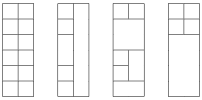

## 题目描述

使用宽度和高度均为整数的矩形积木，搭建一个宽度为 2、高度为 `n` 的塔。

积木数量不限。如果两个塔旋转或镜像后看起来不同，则视为不同方案。

例如，下面是一些高度为 6 的塔：



给定 `n`，求一共有多少种不同的搭建方案。

## 输入

第一行包含一个整数 `t`，表示询问数量。

接下来 `t` 行，每行包含一个整数 `n`，表示塔的高度。

## 输出

对于每个询问，输出高度为 `n` 的塔的搭建方案数，答案对 `10^9+7` 取模。

## 样例输入

```text
3
2
6
1337
```

## 样例输出

```text
8
2864
640403945
```

## 数据范围

- 1 ≤ t ≤ 100
- 1 ≤ n ≤ 10^6

## 题解

根据塔最上方两个格子的连接情况，分成两种状态：

- `dp[i][0]`：高度为 `i`，顶部由左右两个分开的积木组成；
- `dp[i][1]`：高度为 `i`，顶部由一个横跨两列的积木组成。

对于分开状态，左右两块都可以选择继续向上延伸或者重新放置，共有 4 种情况；从连接状态变成分开状态有 1 种情况：

$$
dp[i][0]=4\times dp[i-1][0]+dp[i-1][1]
$$

对于连接状态，可以让原来的宽积木继续延伸，或者重新放置一个宽积木，共有 2 种情况；从分开状态变成连接状态有 1 种情况：

$$
dp[i][1]=2\times dp[i-1][1]+dp[i-1][0]
$$

高度为 1 时，两种状态各有一种方案。最终答案是两种状态之和。

由于有多组询问，可以预处理所有高度的答案。

## 复杂度分析

预处理时间复杂度为 `O(10^6)`，每次询问的时间复杂度为 `O(1)`。

空间复杂度为 `O(10^6)`。

## code

```C++
#include <bits/stdc++.h>
using namespace std;

const int MOD=1e9+7; 

int main(){
    ios::sync_with_stdio(0);
    cin.tie(0);
    cout.tie(0);

    int n;

    vector<vector<long long>> dp(1e6+5,vector<long long>(2,0));

    dp[1][0]=1;
    dp[1][1]=1;

    for(int i=2;i<=1e6;i++){
        dp[i][0]=(dp[i-1][0]*4+dp[i-1][1])%MOD;
        dp[i][1]=(dp[i-1][1]*2+dp[i-1][0])%MOD;
    }

    cin>>n;

    int x;

    for(int i=0;i<n;i++){
        cin>>x;
        cout<<(dp[x][0]+dp[x][1])%MOD<<'\n';
    }
}
```
